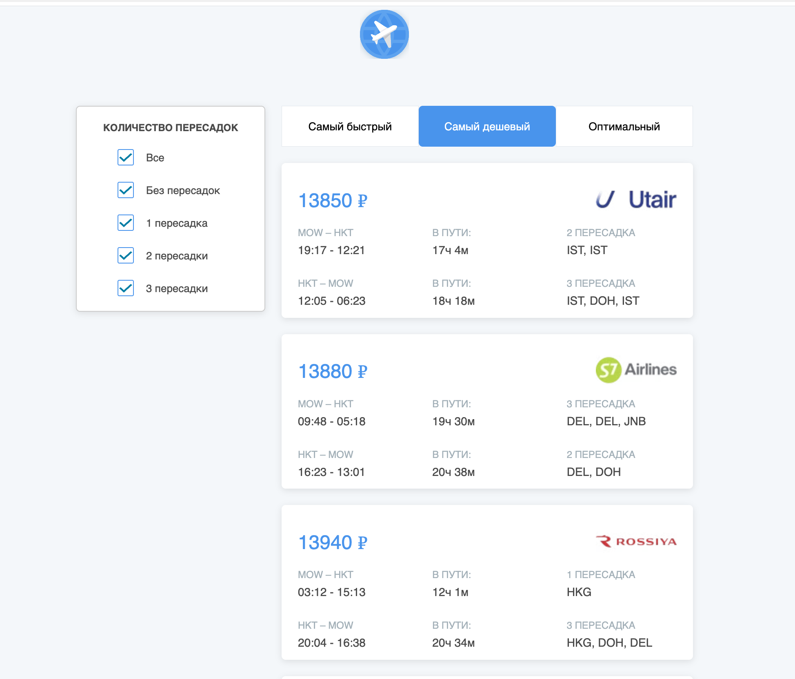

**Tickets App** — это приложение для поиска и фильтрации авиабилетов. Пользователи могут сортировать билеты по цене, продолжительности полета и другим параметрам, а также загружать дополнительные билеты для просмотра.
👉 [Посмотреть демо](https://xenia-golb.github.io/aviasales__react)

## 🚀 Возможности

- **Сортировка билетов** по цене, длительности полета и другим параметрам.
- **Фильтрация** по количеству пересадок.
- **Загрузка дополнительных билетов** (по 5 штук за раз).

## 🛠️ Технологии

- **React** — библиотека для построения пользовательского интерфейса.
- **Redux** — управление состоянием приложения.
- **SCSS** — стилизация компонентов.
- **Vite** — сборка проекта.
- **Axios** - для работы с API.
- **GitHub Pages** — хостинг приложения.

## 📸 Скриншоты

_Главная страница с билетами и фильтрами_
